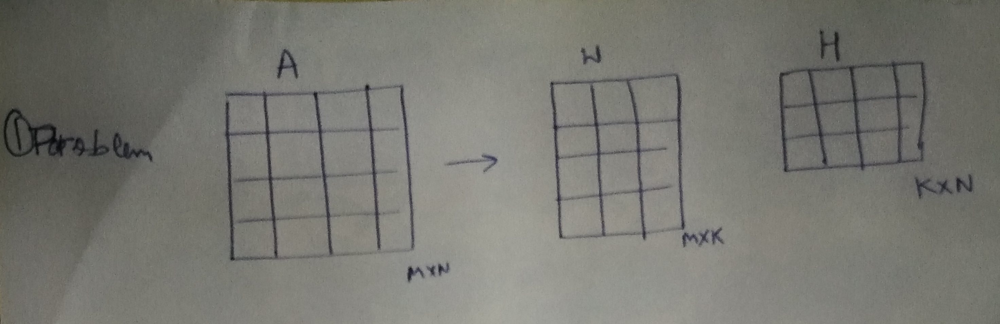
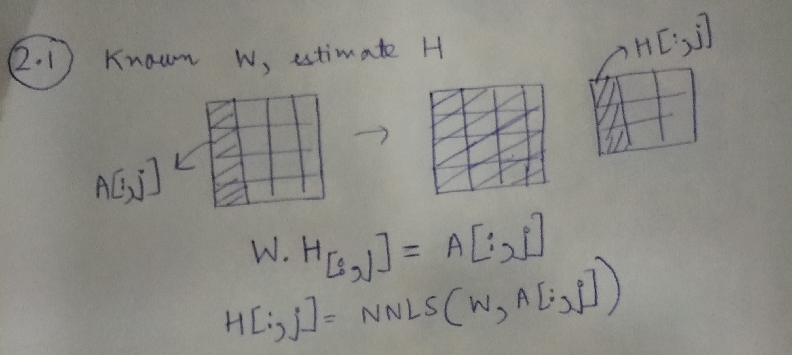
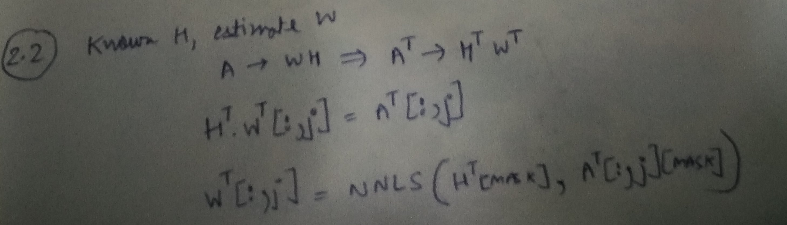

# Non-negative matrix factorisation using non-negative least squares

In this post, I will write about using non-negative least squares (NNLS) for the problem of non-negative matrix factorisation (NNMF). We often encounter such matrices in the problem of collaborative filtering.

### Problem

Our goal is given a matrix A, decompose it into two non-negative factors, as follows:

$ A_{M \times N} \approx W_{M \times K} \times H_{K \times N} $, such that $ W_{M \times K} \ge 0$ and $ H_{K \times N} \ge 0$ 



### Overview

Our solution consists of two steps. First, we fix W and learn H, given A. Next, we fix H and learn W, given A. We repeat this procedure iteratively. Fixing one variable and learning the other (in this setting) is popularly known as alternating least squares, as the problem is reduced to a least squares problem. However, an important thing to note is that since we want to constraint W and H to be non-negative, we us NNLS instead of least squares.

### Step 1: Learning H, given A and W



Using the illustration above, we can learn each column of H, using the corresponding column from A and the matrix W.

$$
\begin{equation}H[:, j] = NNLS (W, A[:,j]) \end{equation}
$$

### Handling missing entries in A

In the problem of collaborative filtering, A is usually the user-item matrix and it has a lot of missing entries. These missing entries correspond to user who have not rated items. We can modify our formulation to account for these missing entries. 

Consider that $M' \le M$ entries in A have observed data, we would now modify the above equation as:


$$
\begin{equation}H[:, j] = NNLS (W [mask], A[:,j][mask]) \end{equation}
$$

where, the mask is found by considering only the $M'$ entries.

### Step 2: Learning W, given A and H



We follow similar procedure. What must be noted is that to get our matrices in the form that NNLLS accepts, I started with A^T instead of A.

### Code example

I'll now present a simple code example to illustrate the procedure.

#### Defining matrix A


```python
import numpy as np
import pandas as pd

M, N = 20, 10

np.random.seed(0)
A_orig = np.abs(np.random.uniform(low=0.0, high=1.0, size=(M,N)))
pd.DataFrame(A_orig).head()
```


<div>
<table border="1" class="dataframe">
  <thead>
    <tr style="text-align: right;">
      <th></th>
      <th>0</th>
      <th>1</th>
      <th>2</th>
      <th>3</th>
      <th>4</th>
      <th>5</th>
      <th>6</th>
      <th>7</th>
      <th>8</th>
      <th>9</th>
    </tr>
  </thead>
  <tbody>
    <tr>
      <th>0</th>
      <td>0.548814</td>
      <td>0.715189</td>
      <td>0.602763</td>
      <td>0.544883</td>
      <td>0.423655</td>
      <td>0.645894</td>
      <td>0.437587</td>
      <td>0.891773</td>
      <td>0.963663</td>
      <td>0.383442</td>
    </tr>
    <tr>
      <th>1</th>
      <td>0.791725</td>
      <td>0.528895</td>
      <td>0.568045</td>
      <td>0.925597</td>
      <td>0.071036</td>
      <td>0.087129</td>
      <td>0.020218</td>
      <td>0.832620</td>
      <td>0.778157</td>
      <td>0.870012</td>
    </tr>
    <tr>
      <th>2</th>
      <td>0.978618</td>
      <td>0.799159</td>
      <td>0.461479</td>
      <td>0.780529</td>
      <td>0.118274</td>
      <td>0.639921</td>
      <td>0.143353</td>
      <td>0.944669</td>
      <td>0.521848</td>
      <td>0.414662</td>
    </tr>
    <tr>
      <th>3</th>
      <td>0.264556</td>
      <td>0.774234</td>
      <td>0.456150</td>
      <td>0.568434</td>
      <td>0.018790</td>
      <td>0.617635</td>
      <td>0.612096</td>
      <td>0.616934</td>
      <td>0.943748</td>
      <td>0.681820</td>
    </tr>
    <tr>
      <th>4</th>
      <td>0.359508</td>
      <td>0.437032</td>
      <td>0.697631</td>
      <td>0.060225</td>
      <td>0.666767</td>
      <td>0.670638</td>
      <td>0.210383</td>
      <td>0.128926</td>
      <td>0.315428</td>
      <td>0.363711</td>
    </tr>
  </tbody>
</table>
</div>


#### Masking a few entries


```python
A = A_orig.copy()
A[0, 0] = np.NAN
A[3, 1] = np.NAN
A[6, 3] = np.NAN
```


```python
A_df = pd.DataFrame(A)
A_df.head()
```


<div>
<table border="1" class="dataframe">
  <thead>
    <tr style="text-align: right;">
      <th></th>
      <th>0</th>
      <th>1</th>
      <th>2</th>
      <th>3</th>
      <th>4</th>
      <th>5</th>
      <th>6</th>
      <th>7</th>
      <th>8</th>
      <th>9</th>
    </tr>
  </thead>
  <tbody>
    <tr>
      <th>0</th>
      <td>NaN</td>
      <td>0.715189</td>
      <td>0.602763</td>
      <td>0.544883</td>
      <td>0.423655</td>
      <td>0.645894</td>
      <td>0.437587</td>
      <td>0.891773</td>
      <td>0.963663</td>
      <td>0.383442</td>
    </tr>
    <tr>
      <th>1</th>
      <td>0.791725</td>
      <td>0.528895</td>
      <td>0.568045</td>
      <td>0.925597</td>
      <td>0.071036</td>
      <td>0.087129</td>
      <td>0.020218</td>
      <td>0.832620</td>
      <td>0.778157</td>
      <td>0.870012</td>
    </tr>
    <tr>
      <th>2</th>
      <td>0.978618</td>
      <td>0.799159</td>
      <td>0.461479</td>
      <td>0.780529</td>
      <td>0.118274</td>
      <td>0.639921</td>
      <td>0.143353</td>
      <td>0.944669</td>
      <td>0.521848</td>
      <td>0.414662</td>
    </tr>
    <tr>
      <th>3</th>
      <td>0.264556</td>
      <td>NaN</td>
      <td>0.456150</td>
      <td>0.568434</td>
      <td>0.018790</td>
      <td>0.617635</td>
      <td>0.612096</td>
      <td>0.616934</td>
      <td>0.943748</td>
      <td>0.681820</td>
    </tr>
    <tr>
      <th>4</th>
      <td>0.359508</td>
      <td>0.437032</td>
      <td>0.697631</td>
      <td>0.060225</td>
      <td>0.666767</td>
      <td>0.670638</td>
      <td>0.210383</td>
      <td>0.128926</td>
      <td>0.315428</td>
      <td>0.363711</td>
    </tr>
  </tbody>
</table>
</div>


#### Defining matrices W and H


```python
K = 4
W = np.abs(np.random.uniform(low=0, high=1, size=(M, K)))
H = np.abs(np.random.uniform(low=0, high=1, size=(K, N)))
W = np.divide(W, K*W.max())
H = np.divide(H, K*H.max())
```


```python
pd.DataFrame(W).head()
```


<div>
<table border="1" class="dataframe">
  <thead>
    <tr style="text-align: right;">
      <th></th>
      <th>0</th>
      <th>1</th>
      <th>2</th>
      <th>3</th>
    </tr>
  </thead>
  <tbody>
    <tr>
      <th>0</th>
      <td>0.078709</td>
      <td>0.175784</td>
      <td>0.095359</td>
      <td>0.045339</td>
    </tr>
    <tr>
      <th>1</th>
      <td>0.006230</td>
      <td>0.016976</td>
      <td>0.171505</td>
      <td>0.114531</td>
    </tr>
    <tr>
      <th>2</th>
      <td>0.135453</td>
      <td>0.226355</td>
      <td>0.250000</td>
      <td>0.054753</td>
    </tr>
    <tr>
      <th>3</th>
      <td>0.167387</td>
      <td>0.066473</td>
      <td>0.005213</td>
      <td>0.191444</td>
    </tr>
    <tr>
      <th>4</th>
      <td>0.080785</td>
      <td>0.096801</td>
      <td>0.148514</td>
      <td>0.209789</td>
    </tr>
  </tbody>
</table>
</div>


```python
pd.DataFrame(H).head()
```


<div>
<table border="1" class="dataframe">
  <thead>
    <tr style="text-align: right;">
      <th></th>
      <th>0</th>
      <th>1</th>
      <th>2</th>
      <th>3</th>
      <th>4</th>
      <th>5</th>
      <th>6</th>
      <th>7</th>
      <th>8</th>
      <th>9</th>
    </tr>
  </thead>
  <tbody>
    <tr>
      <th>0</th>
      <td>0.074611</td>
      <td>0.216164</td>
      <td>0.157328</td>
      <td>0.003370</td>
      <td>0.088415</td>
      <td>0.037721</td>
      <td>0.250000</td>
      <td>0.121806</td>
      <td>0.126649</td>
      <td>0.162827</td>
    </tr>
    <tr>
      <th>1</th>
      <td>0.093851</td>
      <td>0.034858</td>
      <td>0.209333</td>
      <td>0.048340</td>
      <td>0.130195</td>
      <td>0.057117</td>
      <td>0.024914</td>
      <td>0.219537</td>
      <td>0.247731</td>
      <td>0.244654</td>
    </tr>
    <tr>
      <th>2</th>
      <td>0.230833</td>
      <td>0.197093</td>
      <td>0.084828</td>
      <td>0.020651</td>
      <td>0.103694</td>
      <td>0.059133</td>
      <td>0.033735</td>
      <td>0.013604</td>
      <td>0.184756</td>
      <td>0.002910</td>
    </tr>
    <tr>
      <th>3</th>
      <td>0.196210</td>
      <td>0.037417</td>
      <td>0.020248</td>
      <td>0.022815</td>
      <td>0.171121</td>
      <td>0.062477</td>
      <td>0.107081</td>
      <td>0.141921</td>
      <td>0.219119</td>
      <td>0.185125</td>
    </tr>
  </tbody>
</table>
</div>


#### Defining the cost that we want to minimise


```python
def cost(A, W, H):
    from numpy import linalg
    WH = np.dot(W, H)
    A_WH = A-WH
    return linalg.norm(A_WH, 'fro')
```

However, since A has missing entries, we have to define the cost in terms of the entries present in A


```python
def cost(A, W, H):
    from numpy import linalg
    mask = pd.DataFrame(A).notnull().values
    WH = np.dot(W, H)
    WH_mask = WH[mask]
    A_mask = A[mask]
    A_WH_mask = A_mask-WH_mask
    # Since now A_WH_mask is a vector, we use L2 instead of Frobenius norm for matrix
    return linalg.norm(A_WH_mask, 2)
```

Let us just try to see the cost of the initial set of values of W and H we randomly assigned.


```python
cost(A, W, H)
```


    7.3719938519859509


#### Alternating NNLS procedure


```python
num_iter = 1000
num_display_cost = max(int(num_iter/10), 1)
from scipy.optimize import nnls

for i in range(num_iter):
    if i%2 ==0:
        # Learn H, given A and W
        for j in range(N):
            mask_rows = pd.Series(A[:,j]).notnull()
            H[:,j] = nnls(W[mask_rows], A[:,j][mask_rows])[0]
    else:
        for j in range(M):
            mask_rows = pd.Series(A[j,:]).notnull()
            W[j,:] = nnls(H.transpose()[mask_rows], A[j,:][mask_rows])[0]
    WH = np.dot(W, H)
    c = cost(A, W, H)
    if i%num_display_cost==0:
        print i, c
        
```

    0 4.03939072472
    100 2.38059096458
    200 2.35814781954
    300 2.35717011529
    400 2.35711130357
    500 2.3571079918
    600 2.35710729854
    700 2.35710713129
    800 2.35710709085
    900 2.35710708109


```python
A_pred = pd.DataFrame(np.dot(W, H))
A_pred.head()
```


<div>
<table border="1" class="dataframe">
  <thead>
    <tr style="text-align: right;">
      <th></th>
      <th>0</th>
      <th>1</th>
      <th>2</th>
      <th>3</th>
      <th>4</th>
      <th>5</th>
      <th>6</th>
      <th>7</th>
      <th>8</th>
      <th>9</th>
    </tr>
  </thead>
  <tbody>
    <tr>
      <th>0</th>
      <td>0.564235</td>
      <td>0.677712</td>
      <td>0.558999</td>
      <td>0.631337</td>
      <td>0.536069</td>
      <td>0.621925</td>
      <td>0.629133</td>
      <td>0.656010</td>
      <td>0.839802</td>
      <td>0.545072</td>
    </tr>
    <tr>
      <th>1</th>
      <td>0.788734</td>
      <td>0.539729</td>
      <td>0.517534</td>
      <td>1.041272</td>
      <td>0.119894</td>
      <td>0.448402</td>
      <td>0.172808</td>
      <td>0.658696</td>
      <td>0.493093</td>
      <td>0.825311</td>
    </tr>
    <tr>
      <th>2</th>
      <td>0.749886</td>
      <td>0.575154</td>
      <td>0.558981</td>
      <td>0.931156</td>
      <td>0.270149</td>
      <td>0.502035</td>
      <td>0.287008</td>
      <td>0.656178</td>
      <td>0.588916</td>
      <td>0.741519</td>
    </tr>
    <tr>
      <th>3</th>
      <td>0.377419</td>
      <td>0.743081</td>
      <td>0.370408</td>
      <td>0.637094</td>
      <td>0.071684</td>
      <td>0.529433</td>
      <td>0.767696</td>
      <td>0.628507</td>
      <td>0.832910</td>
      <td>0.605742</td>
    </tr>
    <tr>
      <th>4</th>
      <td>0.458661</td>
      <td>0.327143</td>
      <td>0.610012</td>
      <td>0.233134</td>
      <td>0.685559</td>
      <td>0.377750</td>
      <td>0.281483</td>
      <td>0.269960</td>
      <td>0.468756</td>
      <td>0.114950</td>
    </tr>
  </tbody>
</table>
</div>


Let's view the values of the masked entries. 


```python
A_pred.values[~pd.DataFrame(A).notnull().values]
```


    array([ 0.56423481,  0.74308143,  0.10283106])


Original values were:


```python
A_orig[~pd.DataFrame(A).notnull().values]
```


    array([ 0.5488135 ,  0.77423369,  0.13818295])


There you go, we are able to get recover A using a lower ranked decomposition consisting of non-negative terms only.
